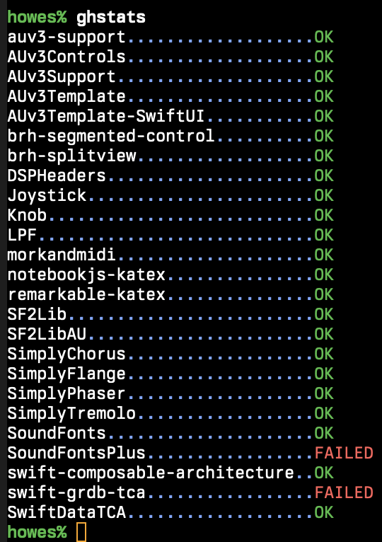

# ghstats

This is a simple Python script that fetches the status of all of your known GitHub repositories and 
shows their current 'build' or CI pipeline status.



# Installing

There is a Bash shell script [install.sh](install.sh) which will create a Python virtual environment with the necessary
Python dependencies ([PyGithub](https://github.com/PyGithub/PyGithub) and [termcolor](https://github.com/termcolor/termcolor)).

Run the script:

```
% ./install.sh
-- root: /Users/howes/Developer/Mine/ghstats
-- creating /Users/howes/Developer/Mine/ghstats/venv using /opt/homebrew/bin/python3
-- activating /Users/howes/Developer/Mine/ghstats/venv
-- installing into /Users/howes/Developer/Mine/ghstats/venv
-- finished (see /Users/howes/Developer/Mine/ghstats/install.log for details)
-- creating ghstats link
% 
```

# Running

After installation, there will be a `ghstats` link that can be executed -- it points to the `run.sh` script in the repository.

Before running though, you first you need to set a `GITHUB_TOKEN` environment variable with a valid GitHub token that
has (at least) read-only rights to your account:

```
% export GITHUB_TOKEN="myMagicGitHubTokenValue"
```

Once done, you should be all set to run:

```
% ./ghstats
auv3-support...................OK
AUv3Controls...................OK
AUv3Support....................OK
AUv3Template...................OK
AUv3Template-SwiftUI...........OK
brh-segmented-control..........OK
brh-splitview..................OK
DSPHeaders.....................OK
Joystick.......................OK
Knob...........................OK
LPF............................OK
morkandmidi....................OK
notebookjs-katex...............OK
remarkable-katex...............OK
SF2Lib.........................OK
SF2LibAU.......................OK
SimplyChorus...................OK
SimplyFlange...................OK
SimplyPhaser...................OK
SimplyTremolo..................OK
SoundFonts.....................OK
SoundFontsPlus.................FAILED
swift-composable-architecture..OK
swift-grdb-tca.................FAILED
SwiftDataTCA...................OK
```

| **Note** that the script can take several seconds to return
